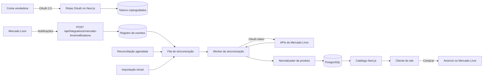
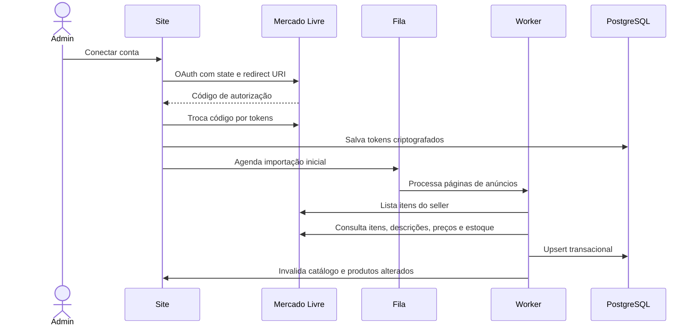
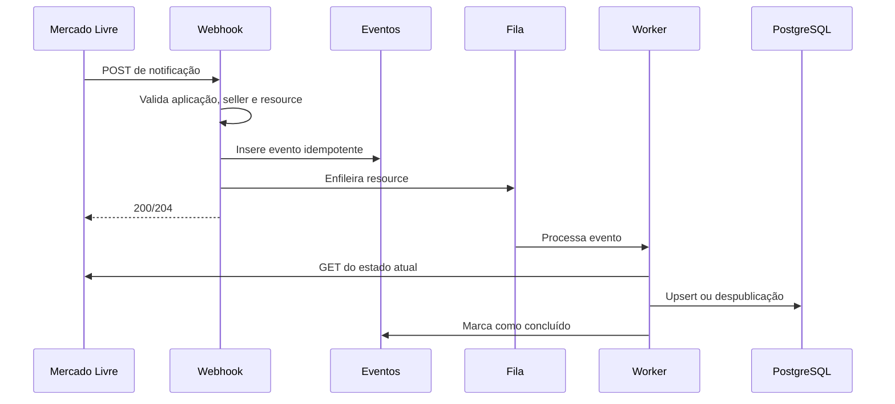

# Arquitetura futura — Catálogo Center Ônibus integrado ao Mercado Livre

Status: proposta para implementação futura  
Escopo: sincronização de produtos do Mercado Livre para o site Center Ônibus  
Direção: Mercado Livre como origem comercial; site como catálogo próprio otimizado para marca, busca e SEO

## 1. Objetivo

Tudo que a equipe alterar nos anúncios do Mercado Livre deve aparecer automaticamente no catálogo do site, sem novo cadastro manual.

O primeiro escopo deve sincronizar:

- anúncios ativos, pausados e encerrados;
- título, descrição e categoria;
- preço, moeda e promoções aplicáveis;
- estoque e disponibilidade;
- fotos e ordem das fotos;
- atributos, medidas, marca, modelo e referências;
- variações e estoque por variação;
- link oficial do anúncio no Mercado Livre.

O checkout continuará no Mercado Livre. O site exibirá o catálogo e levará o usuário ao anúncio pelo CTA “Comprar no Mercado Livre”. Checkout próprio, pedidos, pagamentos e frete ficam fora da primeira versão.

## 2. Decisões principais

| Tema | Decisão |
| --- | --- |
| Fonte comercial | Mercado Livre é a fonte de verdade para preço, estoque, status, fotos e atributos do anúncio. |
| Conteúdo próprio | SEO, destaque na home, ordem editorial, textos técnicos adicionais e categorias internas continuam no banco do site. |
| Leitura do site | As páginas leem o banco local, nunca a API do Mercado Livre diretamente durante cada acesso. |
| Atualização | Notificações atualizam rapidamente; uma reconciliação agendada corrige eventos perdidos. |
| Autorização | OAuth 2.0 com a conta vendedora. Senha do vendedor nunca passa pelo site. |
| Tokens | Somente no servidor, criptografados em repouso e nunca expostos como `NEXT_PUBLIC_*`. |
| Persistência | PostgreSQL gerenciado. O ORM será escolhido na implementação. |
| Processamento | Webhook registra o evento e o envia para uma fila; um worker consulta o estado atual na API e atualiza o banco. |
| Compra | CTA abre o `permalink` oficial do anúncio. |
| Evolução da API | Uma camada adaptadora isola Items, User Products, preços e estoque para reduzir impacto de mudanças do Mercado Livre. |

## 3. Visão geral



Princípio importante: a notificação informa que algo mudou, mas não deve ser aplicada diretamente ao produto. O worker sempre consulta o recurso atual na API e grava o estado mais recente. Isso torna o processamento idempotente e reduz problemas com eventos repetidos ou fora de ordem.

## 4. Responsabilidade de cada componente

### Aplicação Next.js

- oferece as rotas OAuth, callback e webhook por Route Handlers;
- renderiza catálogo e páginas de produto a partir do banco local;
- protege rotas administrativas e rotas chamadas pelo agendador;
- invalida o cache das páginas afetadas depois de uma sincronização;
- gera metadata, sitemap e dados estruturados com o conteúdo local.

### Cliente Mercado Livre

Um módulo isolado concentra todas as chamadas externas:

- autorização e renovação de tokens;
- listagem dos anúncios da conta;
- multiget de itens;
- consulta da descrição;
- consulta do preço vigente;
- consulta de User Products, variações e estoque quando aplicável;
- tratamento de paginação, limites, `401`, `403`, `429` e erros temporários;
- backoff exponencial e renovação única de token em caso de expiração.

Nenhum componente visual deve chamar a API do Mercado Livre diretamente.

### Fila e worker

- o webhook deve responder rapidamente;
- o evento é deduplicado e colocado na fila;
- o worker consulta a API, normaliza e executa um `upsert` transacional;
- falhas temporárias entram em retry com backoff;
- falhas definitivas vão para uma fila de erros e aparecem no painel de integração.

A interface da fila deve ser independente de fornecedor. Possíveis implementações: QStash, SQS ou Google Cloud Tasks.

### PostgreSQL

- guarda o catálogo normalizado utilizado pelo site;
- guarda tokens criptografados e estado da conta integrada;
- registra eventos, tentativas e erros;
- mantém o payload bruto para diagnóstico, sem usá-lo diretamente na UI.

## 5. Propriedade dos dados

| Campo | Origem principal | Pode ter ajuste local? | Regra |
| --- | --- | --- | --- |
| `ml_item_id` | Mercado Livre | Não | Identificador imutável do anúncio. |
| Título comercial | Mercado Livre | Opcional | O site pode ter título SEO separado, sem alterar o anúncio. |
| Descrição comercial | Mercado Livre | Opcional | Texto técnico local pode complementar, nunca sobrescrever silenciosamente. |
| Preço | Mercado Livre | Não | Sempre obtido pela API de preços vigente. |
| Estoque | Mercado Livre | Não | Não inferir pelo valor público de busca. Usar o recurso autorizado do seller. |
| Status | Mercado Livre | Não | Define publicação, ocultação ou arquivamento no site. |
| Fotos | Mercado Livre | Opcional | Ordem segue o anúncio; imagem editorial local pode ser adicionada separadamente. |
| Atributos e variações | Mercado Livre | Não | Normalizados para filtro e ficha técnica. |
| Categoria do site | Site | Sim | Mapeamento interno para navegação da Center Ônibus. |
| Destaque e ordenação | Site | Sim | Não são enviados ao Mercado Livre. |
| Slug | Site | Sim | Criado uma vez e preservado para não perder SEO. |
| SEO title/description | Site | Sim | Conteúdo editorial independente. |

## 6. Modelo de dados proposto

### `marketplace_accounts`

| Campo | Tipo sugerido | Observação |
| --- | --- | --- |
| `id` | UUID | Chave interna. |
| `provider` | text | `mercado_livre`. |
| `seller_id` | bigint/text | Usar tipo compatível com IDs acima de Int32. |
| `application_id` | bigint/text | Aplicação esperada nas notificações. |
| `access_token_encrypted` | text | Nunca em texto puro. |
| `refresh_token_encrypted` | text | Nunca em texto puro. |
| `token_expires_at` | timestamptz | Renovação antecipada. |
| `status` | text | `connected`, `expired`, `revoked`, `error`. |
| `last_full_sync_at` | timestamptz | Saúde da integração. |

### `products`

| Campo | Tipo sugerido | Observação |
| --- | --- | --- |
| `id` | UUID | Chave interna do produto. |
| `slug` | text unique | Não muda automaticamente quando o título muda. |
| `title` | text | Título exibido. |
| `short_title` | text nullable | Versão compacta para cards. |
| `description` | text | Descrição comercial normalizada. |
| `internal_category_id` | UUID nullable | Categoria própria do site. |
| `seo_title` | text nullable | Override editorial. |
| `seo_description` | text nullable | Override editorial. |
| `featured` | boolean | Destaque controlado pelo site. |
| `published` | boolean | Resultado do status e das regras internas. |
| `created_at` / `updated_at` | timestamptz | Auditoria. |

### `marketplace_listings`

| Campo | Tipo sugerido | Observação |
| --- | --- | --- |
| `id` | UUID | Chave interna. |
| `product_id` | UUID FK | Produto associado. |
| `account_id` | UUID FK | Conta proprietária. |
| `ml_item_id` | text unique | Exemplo: `MLB123...`. |
| `ml_user_product_id` | text nullable | Compatibilidade com User Products. |
| `status` | text | `active`, `paused`, `closed`, `under_review`, etc. |
| `permalink` | text | Destino do CTA de compra. |
| `currency` | text | Normalmente `BRL`. |
| `price` | numeric nullable | Preço atual consultado pelo recurso vigente. |
| `original_price` | numeric nullable | Quando disponibilizado pela API de preços. |
| `available_quantity` | integer nullable | Quantidade autorizada da conta. |
| `sold_quantity` | integer nullable | Opcional para analytics, não necessário na UI. |
| `raw_payload` | jsonb | Diagnóstico e compatibilidade futura. |
| `last_synced_at` | timestamptz | Monitoramento de defasagem. |

### `product_images`

- `id`;
- `product_id`;
- `ml_picture_id`;
- `source_url`;
- `alt_text`;
- `position`;
- `width` e `height` quando informados;
- `local_override` para imagens editoriais próprias.

### `product_attributes`

- `product_id`;
- `attribute_id`;
- `name`;
- `value_id`;
- `value_name`;
- `value_type`;
- `position`.

### `product_variations`

- `listing_id`;
- `ml_variation_id`;
- `sku`;
- `attributes` em JSONB;
- `price`;
- `available_quantity`;
- `status`.

### `marketplace_sync_events`

| Campo | Uso |
| --- | --- |
| `event_key` unique | Deduplicação por ID da notificação ou hash determinístico. |
| `topic` | `items`, `items_prices`, `stock-location`, etc. |
| `resource` | Caminho permitido a ser consultado. |
| `seller_id` / `application_id` | Validação de propriedade. |
| `status` | `received`, `queued`, `processing`, `done`, `retry`, `failed`. |
| `attempts` | Controle de retry. |
| `last_error` | Diagnóstico sem registrar tokens ou dados sensíveis. |
| `received_at` / `processed_at` | Auditoria e métricas. |

## 7. Rotas futuras

```text
src/app/api/integrations/mercado-livre/
├── connect/route.ts
├── callback/route.ts
├── notifications/route.ts
├── disconnect/route.ts
└── health/route.ts

src/app/api/internal/mercado-livre/
├── import/route.ts
├── reconcile/route.ts
└── retry-failed/route.ts
```

| Rota | Método | Responsabilidade |
| --- | --- | --- |
| `/connect` | GET | Inicia OAuth com `state` seguro e redirect URI exata. |
| `/callback` | GET | Valida `state`, troca o código por tokens e agenda importação inicial. |
| `/notifications` | POST | Valida, registra, deduplica e enfileira o evento; responde rapidamente. |
| `/disconnect` | POST | Revoga a conexão local e impede novas sincronizações. |
| `/health` | GET protegido | Exibe última sincronização, token e quantidade de falhas. |
| `/internal/import` | POST protegido | Importação completa inicial. |
| `/internal/reconcile` | POST protegido | Reconciliação periódica de todos os anúncios. |
| `/internal/retry-failed` | POST protegido | Reprocessa eventos corrigidos ou falhos. |

As rotas internas devem exigir segredo do agendador ou autenticação administrativa. Nenhuma delas pode aceitar livremente um `seller_id` enviado pelo navegador.

## 8. Organização sugerida do código

```text
src/
├── app/
│   ├── api/integrations/mercado-livre/...
│   ├── api/internal/mercado-livre/...
│   ├── produtos/page.tsx
│   └── produtos/[slug]/page.tsx
├── lib/
│   ├── db/
│   │   ├── client.ts
│   │   ├── schema.ts
│   │   └── migrations/
│   ├── marketplace/
│   │   ├── ports.ts
│   │   └── mercado-livre/
│   │       ├── client.ts
│   │       ├── oauth.ts
│   │       ├── prices.ts
│   │       ├── stock.ts
│   │       ├── mapper.ts
│   │       ├── notifications.ts
│   │       └── types.ts
│   ├── products/
│   │   ├── repository.ts
│   │   ├── queries.ts
│   │   └── sync-listing.ts
│   └── queue/
│       ├── port.ts
│       └── provider.ts
└── workers/
    ├── sync-marketplace-item.ts
    └── reconcile-marketplace.ts
```

O módulo `marketplace/ports.ts` evita que o catálogo dependa diretamente de estruturas do Mercado Livre. Se a API migrar de Items para User Products, apenas o adaptador precisa mudar.

## 9. Fluxos

### Conexão e importação inicial



Para volumes maiores, usar paginação e multiget. O importador deve salvar checkpoints para continuar do último lote em caso de falha.

### Atualização por notificação



### Reconciliação

Executar a cada 4–6 horas:

1. listar todos os anúncios da conta;
2. comparar IDs e `last_synced_at`;
3. atualizar anúncios divergentes;
4. marcar como ausentes/arquivados os que não aparecem mais;
5. gerar um relatório de diferenças e falhas.

Uma reconciliação completa diária funciona como segurança adicional.

## 10. Mapeamento de status

| Mercado Livre | Site |
| --- | --- |
| `active` | Produto publicado e comprável pelo link externo. |
| `paused` | Oculto da listagem; rota pode mostrar “temporariamente indisponível” se houver valor de SEO. |
| `closed` | Arquivado e removido do catálogo; manter redirect quando houver substituto. |
| `under_review` | Oculto até regularização. |
| `inactive` ou status desconhecido | Oculto por segurança e enviado para revisão. |

Nunca assumir que um status novo deve ser publicado. O comportamento padrão para status desconhecido deve ser ocultar e alertar.

## 11. Preço e estoque

- não depender permanentemente dos campos históricos `price`, `base_price` e `original_price` de `/items`;
- encapsular a consulta no adaptador de preços e usar o recurso vigente para o contexto brasileiro;
- assinar o tópico de notificações de preço aplicável;
- usar dados autorizados do seller para estoque real;
- suportar `User Products` e notificações de `stock-location` quando a conta/anúncio utilizar esse modelo;
- não considerar o estoque referencial de buscas públicas como quantidade real;
- preço ou estoque ausente deve produzir “Consulte disponibilidade”, nunca `R$ 0,00` ou estoque inventado.

## 12. Fotos

Opção inicial recomendada:

1. guardar IDs e URLs retornadas pela API;
2. configurar o `next/image` apenas para os hosts efetivamente encontrados nos payloads;
3. usar largura, altura e `sizes` adequados;
4. manter placeholder local para falhas;
5. não copiar ou transformar imagens sem necessidade.

Se a estabilidade das URLs externas se tornar um problema, adicionar posteriormente um processo de espelhamento para storage próprio. O banco deve manter a relação com o `ml_picture_id` para detectar substituições.

## 13. Cache, SEO e slugs

- o catálogo consulta o PostgreSQL e pode utilizar cache do Next.js;
- depois do `upsert`, invalidar a listagem, a página do slug e sitemap quando necessário;
- o slug é criado no primeiro import e não muda automaticamente;
- se um slug precisar mudar, criar redirect permanente;
- gerar metadata usando overrides locais e fallback para o anúncio;
- adicionar `Product` em JSON-LD apenas com preço e disponibilidade válidos;
- anúncios pausados não devem continuar aparecendo em sitemap;
- o CTA externo deve usar o `permalink` salvo e permitir rastreamento de clique sem alterar o destino.

## 14. Segurança

- `ML_CLIENT_SECRET`, tokens e chave de criptografia nunca usam prefixo `NEXT_PUBLIC_`;
- tokens criptografados com chave mantida no gerenciador de segredos da hospedagem;
- renovar access token antecipadamente e atualizar refresh token de forma atômica;
- validar `state` no OAuth para reduzir risco de CSRF;
- exigir a mesma redirect URI cadastrada na aplicação;
- validar `application_id`, `user_id`, tópico e prefixo permitido de `resource` nas notificações;
- nunca concatenar o `resource` recebido em qualquer domínio; consultar somente a base oficial permitida;
- limitar tamanho do body e aplicar rate limit na rota de webhook;
- não registrar tokens, headers de autorização ou secrets;
- separar permissões de leitura e escrita; para o primeiro escopo, solicitar somente o necessário;
- proteger importação, reconciliação e retry com autenticação administrativa/segredo rotacionável.

## 15. Variáveis de ambiente previstas

```text
DATABASE_URL=
ML_CLIENT_ID=
ML_CLIENT_SECRET=
ML_REDIRECT_URI=
ML_EXPECTED_SELLER_ID=
ML_EXPECTED_APPLICATION_ID=
TOKEN_ENCRYPTION_KEY=
SYNC_QUEUE_URL=
SYNC_QUEUE_TOKEN=
SYNC_CRON_SECRET=
```

Nenhuma variável acima deve ser enviada ao navegador. Para ambiente local, os arquivos `.env.*.local` permanecem fora do Git.

## 16. Observabilidade

Métricas mínimas:

- data e duração da última importação completa;
- data do último evento recebido e processado;
- produtos ativos no Mercado Livre versus publicados no site;
- latência entre notificação e atualização no site;
- eventos com retry e eventos definitivamente falhos;
- erros por endpoint e status HTTP;
- renovações de token e falhas de autenticação;
- produtos sem preço, imagem, estoque ou categoria interna.

Alertas recomendados:

- nenhuma notificação recebida por período anormal;
- reconciliação com diferença acima do limite;
- token revogado/expirado sem renovação;
- fila acumulada;
- taxa elevada de `401`, `403`, `429` ou `5xx`;
- produto ativo há mais de 30 minutos sem sincronização.

## 17. Estratégia de testes

### Unitários

- mapper de item para produto local;
- mapeamento de status;
- normalização de atributos e variações;
- geração e preservação de slug;
- cálculo do fingerprint de eventos;
- renovação de token e backoff.

### Integração

- OAuth callback com `state` válido e inválido;
- webhook repetido processado uma única vez;
- evento fora de ordem convergindo para o estado atual;
- item pausado, encerrado e reativado;
- mudança de preço e estoque;
- falha temporária seguida de retry;
- token expirado durante sincronização;
- reconciliação identificando item ausente.

### E2E

- produto importado aparece no catálogo;
- alterações aparecem na página correta;
- item pausado deixa de aparecer;
- CTA abre o permalink correto;
- catálogo continua disponível quando a API do Mercado Livre está fora do ar.

## 18. Migração do catálogo atual

Hoje o catálogo está definido em `src/app/_content/products.ts`. A migração deve ser gradual:

### Fase 1 — Fundação

- criar PostgreSQL e migrations;
- criar repositório `ProductRepository`;
- importar os produtos estáticos atuais para o banco;
- manter fallback temporário para o arquivo atual;
- adaptar listagem e detalhe para consultar o repositório.

### Fase 2 — Integração autorizada

- criar aplicação no DevCenter;
- implementar OAuth e armazenamento seguro de tokens;
- implementar cliente de leitura;
- importar anúncios ativos para uma área de revisão;
- mapear anúncios existentes aos produtos locais por código/SKU, nunca apenas por título.

### Fase 3 — Publicação automática

- ativar notificações;
- habilitar fila e worker;
- publicar automaticamente somente itens que passem nas regras de qualidade;
- configurar CTA “Comprar no Mercado Livre”.

### Fase 4 — Resiliência

- reconciliação agendada;
- painel de saúde e retry;
- alertas;
- testes de volume e limites da API;
- remover o fallback para `_content/products.ts` após período estável.

### Fase 5 — Evoluções opcionais

- perguntas e reputação do vendedor;
- analytics de clique e conversão;
- espelhamento próprio de imagens;
- múltiplas contas ou marketplaces;
- checkout próprio e sincronização bidirecional de pedidos, fora do escopo inicial.

## 19. Critérios de aceite do MVP

- uma conta do Mercado Livre conecta e renova tokens sem intervenção diária;
- importação inicial traz todos os anúncios ativos esperados;
- título, fotos, descrição, atributos, preço, estoque e permalink aparecem corretamente;
- alteração no anúncio chega ao site em até 5 minutos em condições normais;
- item pausado ou encerrado deixa de aparecer automaticamente;
- notificações repetidas não duplicam produtos nem imagens;
- falha da API não derruba o catálogo já publicado;
- reconciliação corrige um evento propositalmente perdido;
- nenhum token ou secret aparece no bundle do navegador ou nos logs;
- páginas mantêm SEO, mobile sem overflow e performance aceitável;
- CTA de compra sempre aponta para o anúncio correto.

## 20. Riscos e mitigação

| Risco | Mitigação |
| --- | --- |
| Mudanças em Items, User Products ou preço | Camada adaptadora, payload bruto e testes com fixtures reais. |
| Evento perdido | Reconciliação agendada. |
| Evento duplicado ou fora de ordem | Registro idempotente e consulta do estado atual. |
| Token revogado | Alerta, estado `revoked` e fluxo de reconexão. |
| Rate limit | Multiget, fila, backoff e limite de concorrência. |
| Produto duplicado | Unique em `ml_item_id` e vinculação por SKU/código na migração. |
| Preço/estoque incorreto | Recursos autorizados e fallback para “Consulte disponibilidade”. |
| SEO quebrado por mudança de título | Slug estável e redirects. |
| API indisponível | Site lê banco local e mantém último estado conhecido. |
| Webhook malicioso | Validação de aplicação, seller, tópico, resource, tamanho e rate limit. |

## 21. Informações necessárias antes da implementação

- URL da conta ou nickname da empresa no Mercado Livre;
- confirmação de que a empresa controla a conta vendedora;
- acesso para criar uma aplicação no DevCenter;
- seller ID autorizado;
- volume aproximado de anúncios e variações;
- existência de SKU/código Center nos anúncios;
- regra para anúncios pausados: ocultar ou manter página indisponível;
- regra para preço: mostrar valor ou sempre “sob consulta”;
- definição do banco PostgreSQL e provedor da fila;
- domínio de produção e URL pública para OAuth/webhook;
- responsável interno por revisar falhas de sincronização.

## 22. Referências oficiais

- OAuth e tokens: <https://developers.mercadolivre.com.br/pt_br/publicacao-de-produtos/gestao-de-identidades-e-acessos-oauth-e-tokens>
- Criar aplicação: <https://developers.mercadolivre.com.br/pt_br/crie-uma-aplicacao-no-mercado-livre>
- Permissões funcionais: <https://developers.mercadolivre.com.br/pt_br/permissoes-funcionais/>
- Itens e buscas: <https://developers.mercadolivre.com.br/pt_br/convivencia-me1-me2/itens-e-buscas>
- Publicação e detalhes de itens: <https://developers.mercadolivre.com.br/pt_br/autenticacao-e-autorizacao/publicacao-de-produtos>
- Notificações: <https://developers.mercadolivre.com.br/pt_br/gerenciamento-de-vendas/produto-receba-notificacoes>
- API de preços: <https://developers.mercadolivre.com.br/devcenter/api-de-precos>
- Desenvolvimento seguro: <https://developers.mercadolivre.com.br/produto-receba-notificacoes/desenvolvimento-seguro>

## 23. Resultado esperado

O operador trabalha somente no Mercado Livre para os dados comerciais. O site recebe e normaliza as alterações, conserva seus próprios campos editoriais e continua rápido mesmo quando a API externa estiver indisponível. A integração reduz retrabalho sem transformar a página pública em uma dependência direta do marketplace.
